<p align="center">
  <strong>SAURABH JAJU</strong> · Senior Software Engineer · Dubai
</p>

<!-- PREMIUM-PROFILE:START -->
<p align="center"></p>

<table><tr>
<td width="50%"></td>
<td width="50%"></td>
</tr></table>

<p align="center"></p>
<p align="center"></p>
<!-- PREMIUM-PROFILE:END -->

<p align="center">
  <a href="https://saurabh-jaju-3d.saurabhjaju2418.chatgpt.site/"><strong>Explore my 3D portfolio ↗</strong></a>
  &nbsp; · &nbsp;
  <a href="https://www.linkedin.com/in/saurabhjaju">LinkedIn</a>
  &nbsp; · &nbsp;
  <a href="https://twitter.com/Saurabh_jaju">X / Twitter</a> &nbsp; · &nbsp; <a href="https://www.facebook.com/saurabh.jaju">Facebook</a> &nbsp; · &nbsp; <a href="https://www.instagram.com/jazz5886">Instagram</a> &nbsp; · &nbsp; <a href="https://www.threads.net/@jazz5886">Threads</a> &nbsp; · &nbsp; <a href="https://discord.gg/3QkRpDwS">Join Discord</a>
  &nbsp; · &nbsp;
  <a href="https://github.com/saurabhjaju2418?tab=repositories">Explore repositories</a>
</p>

<h3 align="center">Backend & Architecture</h3>
<p align="center">
  
  
  
  
</p>
<p align="center">
  
  
  
</p>

<h3 align="center">Cloud, DevOps & Quality</h3>
<p align="center">
  
  
  
  
</p>
<p align="center">
  
  
  <a href="https://github.com/saurabhjaju2418/weekly-linkedin-publisher/actions/workflows/weekly-linkedin.yml"></a>
</p>

<h3 align="center">Product Engineering & AI</h3>
<p align="center">
  
  
  
       
</p>

> I modernize complex systems and help engineering teams deliver reliable software—from Java and Spring Boot services to aviation platforms and AI-assisted workflows.

<details>
<summary><strong>✈️ The engineering story — experience, interests and projects</strong></summary>

### 👨‍💻 About Me

I’m a Senior Software Engineer at Emirates Group IT in Dubai, with 10+ years of experience designing, modernizing, and delivering enterprise software.

My work focuses on scalable backend platforms, aviation technology, API-led integration, engineering quality, and reliable delivery. I combine hands-on development with technical leadership, solution design, code reviews, mentoring, production troubleshooting, and cross-functional collaboration.

- ✈️ Building enterprise solutions for aviation reservation, ticketing, and operational platforms
- 🧩 Modernizing legacy applications into scalable services and API-driven architectures
- 🔐 Promoting secure coding, API standards, automated testing, and quality gates
- 🚀 Improving CI/CD, observability, deployment reliability, and developer experience
- 🤖 Applying AI-assisted engineering to testing, code review, repository analysis, and modernization
- 🤝 Open to collaborating on Java, Spring Boot, developer tooling, and agentic engineering projects

### 🎯 Engineering Interests

- Enterprise application and API modernization
- Distributed systems and microservice architecture
- Secure and observable software platforms
- Developer productivity and automated quality engineering
- Agentic AI integration and repository intelligence
- Automated vulnerability analysis and DevSecOps

### 📌 Selected Public Projects

- [SpringBootRestApiWithAngular](https://github.com/saurabhjaju2418/SpringBootRestApiWithAngular) — Full-stack CRUD application using Spring Boot, Spring Data, and Angular
- [eds-starter6-jpa](https://github.com/saurabhjaju2418/eds-starter6-jpa) — Java, Spring Boot, JPA/Hibernate, and Ext JS application
- [angular-electron](https://github.com/saurabhjaju2418/angular-electron) — Desktop application foundation using Angular and Electron
- [TestApp](https://github.com/saurabhjaju2418/TestApp) — Angular application with Firebase authentication and a JSON REST backend
- [Interactive 3D Portfolio](https://saurabh-jaju-3d.saurabhjaju2418.chatgpt.site/) — Cinematic portfolio covering enterprise engineering, aviation, cloud, DevSecOps, and AI

---

<p align="center"><em>Building reliable software, modernizing complex systems, and helping engineering teams deliver with confidence.</em></p>

</details>

<details>
<summary><strong>⚡ How is this animated? Open the hood.</strong></summary>

No GIFs. No JavaScript. No third-party animation service.

These are self-contained SVG files generated with Python:
- My GitHub avatar becomes dense ASCII using Pillow.
- SMIL clips scan each portrait row with a moving cursor.
- Neofetch lines slide and fade in at 60 ms intervals.
- Real public contribution levels reveal diagonally, with specular flashes and green glows.
- Cyan, purple, orange and green accents connect the remaining sections.

The calendar is a dated snapshot, refreshed by running the generator. It is not fabricated activity.
GitHub's table layout scales the paired cards down on phones; SVG animation support depends on the viewer.

**Regenerate from the repository root:**

```bash
python -m pip install Pillow
python scripts/generate_profile.py
```

Prefer no motion? Generate the static edition:

```bash
python scripts/generate_profile.py --static
```

[Read the generator](./scripts/generate_profile.py). Existing README content outside the marked block is preserved.

</details>

<p align="center"><sub>BUILD WITH INTENT. SHIP WITH CONFIDENCE.</sub></p>
